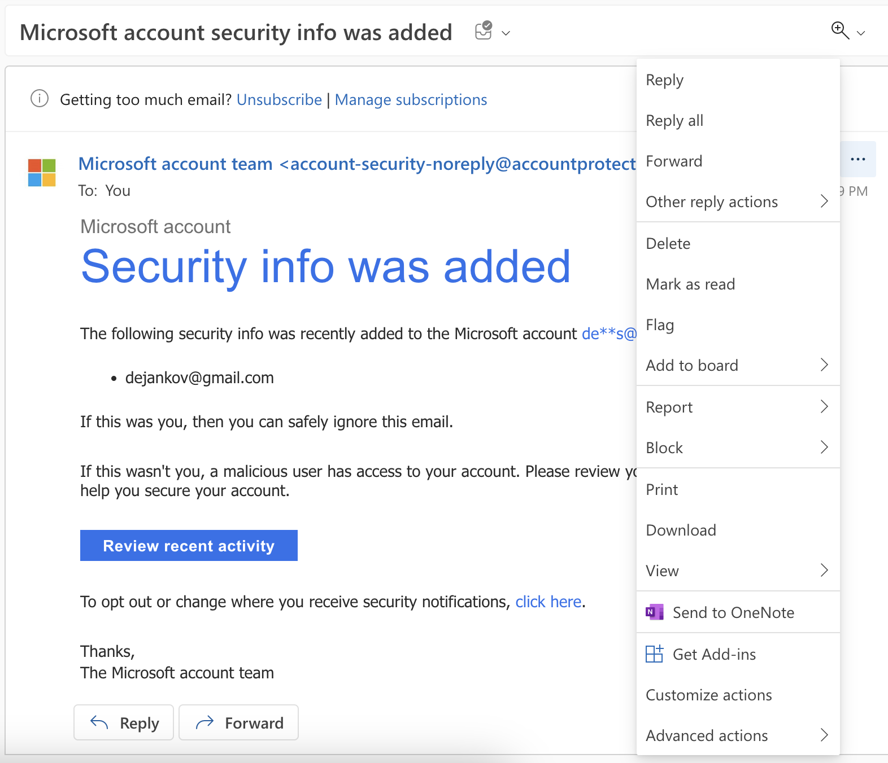
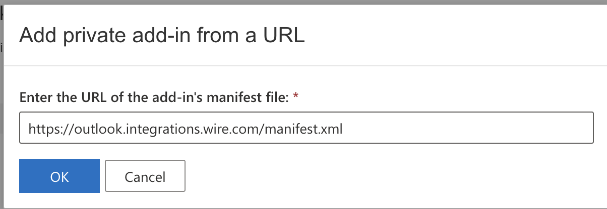

# Wire's Microsoft Outlook Calendar Add-in

Wire add-in for Microsoft Outlook

## Wire Staging Env
```
- name: BASE_URL
value: https://outlook.integrations.zinfra.io

- name: WIRE_API_BASE_URL
value: https://staging-nginz-https.zinfra.io

- name: WIRE_API_VERSION
value: v5

- name: WIRE_AUTHORIZATION_ENDPOINT
value: https://wire-webapp-qa.zinfra.io/auth

- name: CLIENT_ID
value: e30a9b94-8e0d-4b15-8a1a-236f68729cdd
```

## App Config
```
window.config = {
  addInBaseUrl: "${BASE_URL}",
  apiBaseUrl: "${WIRE_API_BASE_URL}",
  apiVersion: "${WIRE_API_VERSION}",
  authorizeUrl: "${WIRE_AUTHORIZATION_ENDPOINT}",
  clientId: "${CLIENT_ID}",
};
```
## API Version
The WIRE_API_VERSION environment variable can be optionally set to define the API version for the application. If not explicitly set, the default value of 'v5' will be used.

## Local Storage
- isLoggedIn
- refresh_token
- access_token

## Feature flag
 - `outlookCalIntegration` - Must be enabled in order to be able to create a group and the link.

## Authorize
- URL: [config.authorizeUrl]
- Callback: [config.addInBaseUrl]/callback.html
- Scope: write:conversations write:conversations_code read:self read:feature_configs
- State: random 16 hex chars
- Verifier: random 64 hex chars

`State` and `Verifier` saved to Session Storage under: `state` and `code_verifier` respectively

## OAuth Callback
- When called verifies the `state` parameter and exchanges `code` for the tokens
- `access_token` and `refresh_token` then stored to Local Storage

## Refresh token
- Upon 401 Add-in will go to: POST [config.apiBaseUrl]/auth/refresh and body = LocalStorage.refresh_token

## Business Logic
- 

## How to create new Service with the BE (Brig)
```agsl
curl -s -X POST localhost:8080/i/oauth/clients \
    -H "Content-Type: application/json" \
    -d '{
      "application_name":"Wire Microsoft Outlook Calendar Add-in",
      "redirect_url":"https://outlook.wire.com/callback.html" 
    }'
```

## How to install the Add-in in MS Outlook
- Open an email and go to 3 dots and select Get Add-ins

- Go to My Add-ins, Custom Add-ins, Add a Custom Add-in

- Pick up a URL and add: https://outlook.integrations.wire.com/manifest.xml

Wire button will appear in the toolbar when new event is being created

## Troubleshooting
- If you are getting `401` error, please make sure that you have enabled the feature flag `outlookCalIntegration` for your account.
- If your browser is blocking third-party cookies, please make sure to allow them for the add-in to work properly. Or you can add `https://outlook.office.com` to the list of allowed websites.
