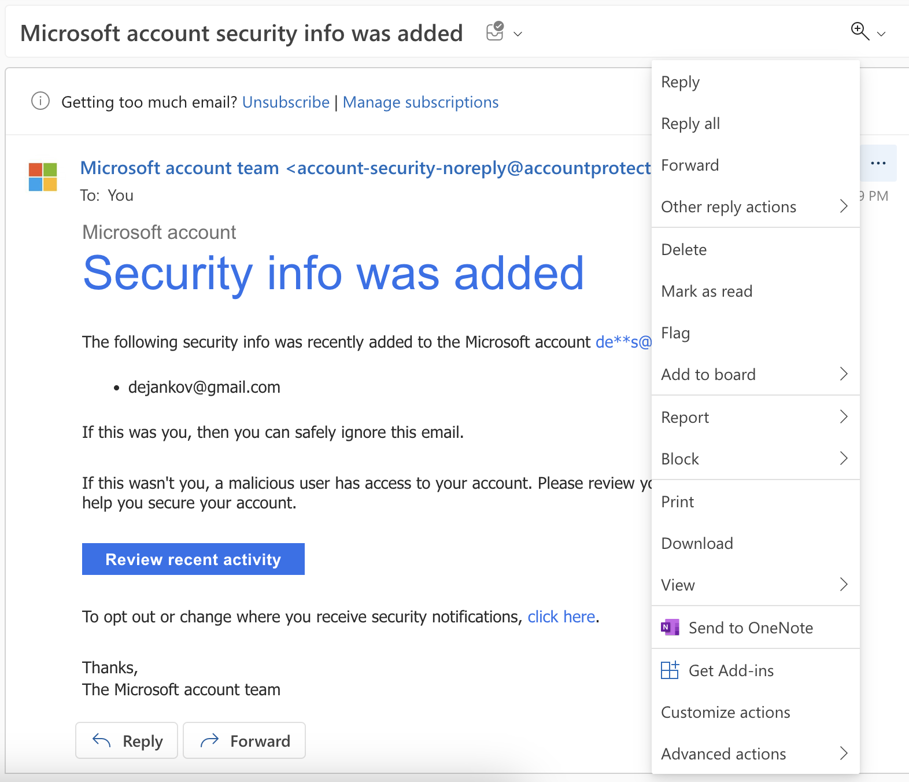
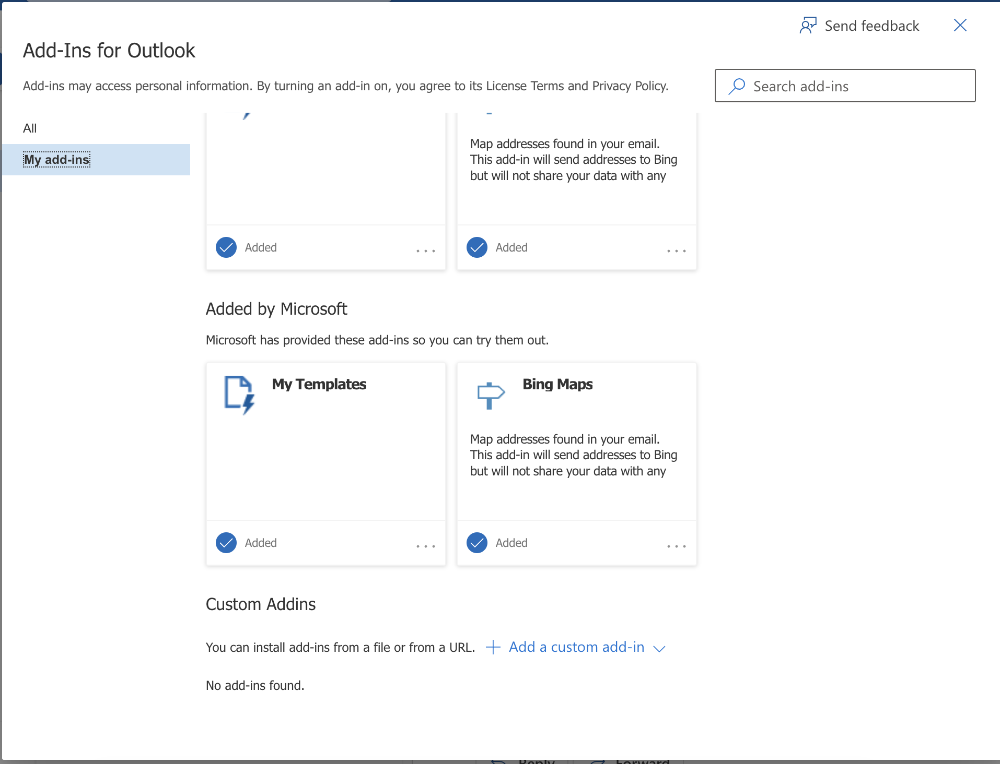
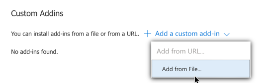

# Wire's Microsoft Outlook Calendar Add-in

Wire add-in for Microsoft Outlook

## Configuration
The program is configured through environment variables listed in the [.env.template](.env.template) file.  
Depending on the deployment mode, the values are substituted differently:
- development – at built time via Webpack plugin;
- production – at container startup via a Docker entrypoint script using `envsubst` command.

The [manifest.xml](manifest.xml.template) file describes the Office Add-in (its name, permissions, and endpoints), 
while [config.js](./src/config.js.template) provides the app with runtime configuration such as API URLs and client IDs.

The actual values for the staging environment are provided in the [.env.staging](.env.staging) file.

### Feature flag
`outlookCalIntegration` – Must be enabled to be able to create a group and the link.

## Local Storage
- isLoggedIn
- refresh_token
- access_token

## Authorize
- URL: [config.authorizeUrl]
- Callback: [config.addInBaseUrl]/callback.html
- Scope: write:conversations write:conversations_code read:self read:feature_configs
- State: random 16 hex chars
- Verifier: random 64 hex chars

`State` and `Verifier` saved to Session Storage under: `state` and `code_verifier` respectively

## OAuth Callback
- When called verifies the `state` parameter and exchanges `code` for the tokens
- `access_token` and `refresh_token` then stored to Local Storage

## Refresh token
- Upon 401 Add-in will go to: POST [config.apiBaseUrl]/auth/refresh and body = LocalStorage.refresh_token

## Business Logic
- 

## How to create new Service with the BE (Brig)
```agsl
curl -s -X POST localhost:8080/i/oauth/clients \
    -H "Content-Type: application/json" \
    -d '{
      "application_name":"Wire Microsoft Outlook Calendar Add-in",
      "redirect_url":"https://outlook.wire.com/callback.html" 
    }'
```

## How to install the Add-in in MS Outlook
- Open an email and go to 3 dots and select Get Add-ins

- Go to My Add-ins, Custom Add-ins, Add a Custom Add-in

- Pick up a URL and add: https://outlook.integrations.wire.com/manifest.xml

Wire button will appear in the toolbar when new event is being created

## Troubleshooting
- If you are getting `401` error, please make sure that you have enabled the feature flag `outlookCalIntegration` for your account.
- If your browser is blocking third-party cookies, please make sure to allow them for the add-in to work properly. Or you can add `https://outlook.office.com` to the list of allowed websites.
